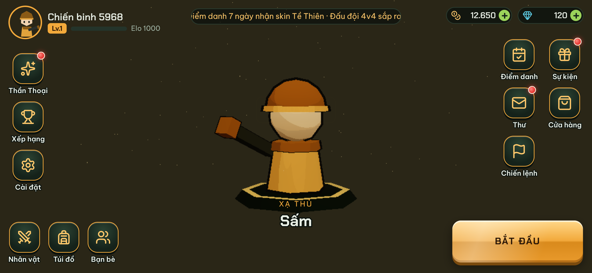
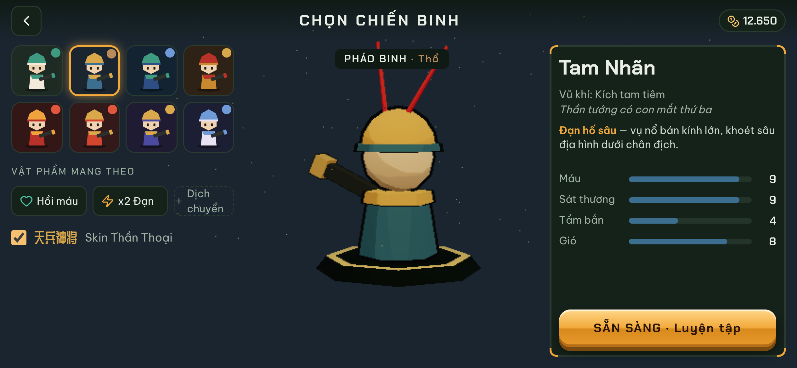
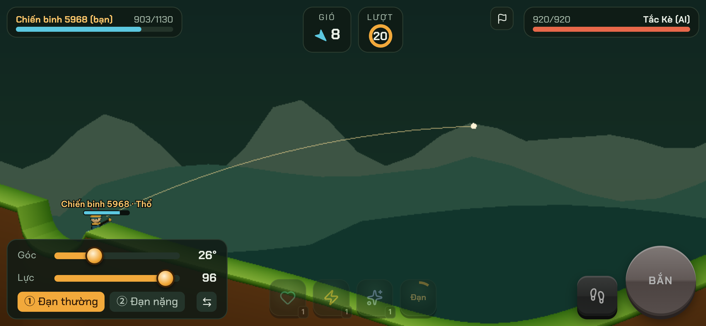
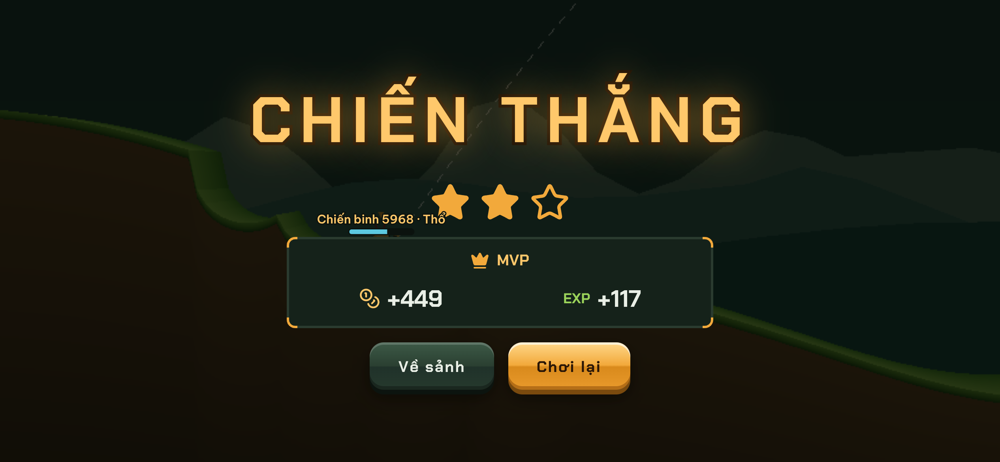

# ARMY 3D · PHÁO CHIẾN ĐỘI

Game bắn pháo theo lượt 3D cho điện thoại (Web mobile / PWA, chơi ngang), xây theo `docs/PROMPT_ARMY3D.md`
và file thiết kế `docs/design/army3d-design.html`.

## Cấu trúc

| Thư mục | Nội dung |
|---|---|
| `packages/shared` | Luật chơi TS thuần dùng chung client + server: đạn đạo bước cố định 60Hz có seed, địa hình heightmap + khoét hố, TurnManager theo delay, Ngũ Hành, 8 nhân vật (JSON), 8 skin Thần Thoại, AI bot, zod schema |
| `apps/server` | NestJS 11: đăng nhập khách bằng JWT, profile/điểm danh/thư/xếp hạng (REST, Swagger ở `/api/docs`), WebSocket `/ws` (socket.io): ghép trận Elo, phòng đấu do server quyết định kết quả, bot, hết 20s tự bỏ lượt, kết nối lại thì gửi snapshot |
| `apps/client` | Vite + React 19 + three.js (@react-three/fiber, drei) + Tailwind 4, motion, GSAP, howler, zustand, i18next (vi / 简体中文 / en), antd-mobile (màn Cài đặt), vConsole (`?debug=1`) |

## Chạy

```bash
pnpm install
pnpm build          # shared → server → client
pnpm dev            # server :3000 + client :5173 (proxy /api, /ws)
# hoặc: docker compose up --build  → http://localhost:8080
```

Mở `http://localhost:5173` trên điện thoại (cùng mạng LAN) hoặc DevTools ở chế độ thiết bị ngang 844×390.

## Test

```bash
pnpm test                     # vitest: shared (11 test: deterministic, Ngũ Hành, terrain…) + server e2e (7 test, socket thật)
pnpm --filter @army3d/client test:e2e   # Playwright: Loading → Lobby → Chọn tướng → Trận → Kết quả, màn dọc, đổi ngôn ngữ
```

Ảnh chụp màn hình do Playwright tạo nằm ở `apps/client/e2e/screenshots/`.

## Đã làm so với prompt

- ✅ Phase 0–4 và phần lớn 5–6: luật chơi deterministic (client replay khớp server 100% trong test), server có quyền quyết định kết quả,
  8 nhân vật + 8 tuyệt chiêu (loạt đôi, hố sâu, nảy 3 lần, xuyên gió, khiên + drone, tách 3 đầu đạn, xích sét, hồi máu),
  vật phẩm (hồi máu, x2 đạn, dịch chuyển), skin Thần Thoại + Ngũ Hành, UI kiểu game Trung Quốc (red-dot, popup nảy + hàng đợi,
  panel 9-slice, nút đầy đặn, marquee, điểm danh 7 ngày, thư, số bay, đếm thưởng), hướng dẫn tân thủ có khoét lỗ,
  thích ứng màn ngang 844×390 + safe-area + màn hình xoay dọc, âm thanh tổng hợp + rung, PWA manifest.
- ⏳ Chưa làm: lưu trữ PostgreSQL/Redis (server đang lưu trong bộ nhớ, đã tách service để thay), model .glb + AnimationMixer
  (đang dùng model procedural toon + viền mực), three.quarks/postprocessing (đang dùng hệ particle InstancedMesh tự viết),
  Spine/Lottie, Đấu đội 2v2/4v4 và Săn Boss (luật chơi đã hỗ trợ nhiều người, chưa mở ghép trận), Storybook.

## Ảnh chụp (Playwright, 844×390 @3x)

| Sảnh | Chọn tướng | Trận đấu | Kết quả |
|---|---|---|---|
|  |  |  |  |
